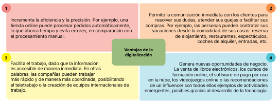
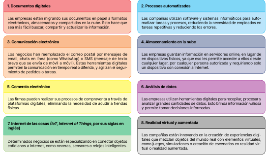

# Digitalización
El proceso de transformar la información analógica (palabras, imágenes o datos numéricos) en formatos digitales, utilizando para ello la tecnología, es decir, realizar de forma electrónica o digital las tareas que antes solían hacerse en papel y de forma manual.

# ¿Por qué se digitalizan las empresas?

# ¿Cómo digitalizan las empresas?

# ¿Cómo cambia la tecnología digital a las empresas?
La implantación de la tecnología digital no consiste únicamente en adoptar nuevas herramientas, sino, sobre todo, en integrarlas de manera estratégica en la organización.

  
**Impacto en los recursos humanos**

  **Desaparición de puestos de trabajo:** Debido a la automatización y mecanización.  
  Aunque también surgen profesiones nuevas, más cualificadas y versátiles, necesarias para manejar, programar y reparar la tecnología en uso.

  
**Impacto en las tareas y forma de trabajo:**

  Cambio en las formas de trabajo. Las tareas repetitivas pueden automatizarse, lo que da lugar a un resultado más preciso, rápido y ordenado, y las tareas complejas pueden simplificarse.

  
Impacto en la comunicación:**
Cambio en las formas de colaboración. Los ordenadores y las aplicaciones	informáticas	ayudan	a	la	coordinación	humana.	Así,	las	videoconferencias, las   plataformas de mensajería instantánea y las herramientas de colaboración en línea permiten una comunicación más fluida y rápida.

- **Impacto en la estructura
