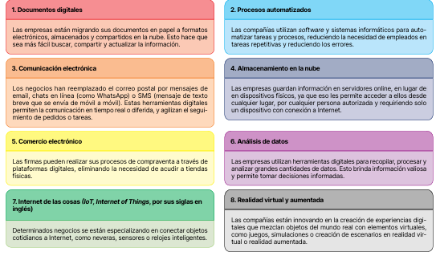

<!-- markdownlint-disable MD033 -->

# Digitalización

El proceso de transformar la información analógica (palabras, imágenes o datos numéricos) en formatos digitales, utilizando para ello la tecnología, es decir, realizar de forma electrónica o digital las tareas que antes solían hacerse en papel y de forma manual.

## ¿Por qué se digitalizan las empresas?

## ¿Cómo digitalizan las empresas?

## ¿Cómo cambia la tecnología digital a las empresas?

La implantación de la tecnología digital no consiste únicamente en adoptar nuevas herramientas, sino, sobre todo, en integrarlas de manera estratégica en la organización.

  

  <strong>Impacto en los recursos humanos: Desaparición de puestos de trabajo</strong>
  

  Debido a la automatización y mecanización.  
  Aunque también surgen profesiones nuevas, más cualificadas y versátiles, necesarias para manejar, programar y reparar la tecnología en uso.

  

  <strong>Impacto en las tareas y forma de trabajo: Cambio en las formas de trabajo.</strong>
  

   Las tareas repetitivas pueden automatizarse, lo que da lugar a un resultado más preciso, rápido y ordenado, y las tareas complejas pueden simplificarse.

  

  <strong>Impacto en la comunicación: Cambio en las formas de colaboración.</strong>
  

   Los ordenadores y las aplicaciones informáticas ayudan a la coordinación humana. Así, las videoconferencias, las   plataformas de mensajería instantánea y las herramientas de colaboración en línea permiten una comunicación más fluida y rápida.

  

  <strong>Impacto en la estructura: Cambios en la cultura organizacional.</strong>
  

   Aunque la tecnología mejora la eficiencia y la satisfacción de los trabajadores, puesto que reduce sus tareas rutinarias y facilita el trabajo en equipo, es normal la resistencia inicial al cambio, dado que el uso de herramientas digitales implica abandonar rutinas y aceptar un proceso de formación permanente.

  

  <strong>Impacto en la jerarquía: cambios en la forma de decisiones.</strong>
  

   La tecnología digital proporciona datos en tiempo real y análisis profundos que respaldan la toma de decisiones. Los líderes pueden tomar decisiones más acertadas basadas en una información precisa y actualizada. Sin embargo, tener acceso a tantos datos y saber interpretarlos requiere de personal multidisciplinar. Por eso, las organizaciones tienden a reducir su jerarquía y organizarse de forma horizontal; es necesario el trabajo en equipo y escuchar las aportaciones de cada especialista en su ámbito.

  

  <strong>Impacto en el marketing: cambios en la relación con los clientes.</strong>
  

   Las tecnologías digitales permiten una mejor comprensión de los clientes mediante el análisis de datos de comportamiento y preferencias. Esto facilita la personalización en la atención al cliente y, en consecuencia, mejora su satisfacción y la relación que establece con la empresa.

## ¿Qué son las tecnologías IT y Ot?

### Tecnologías de la Información (IT)

Son herramientas digitales enfocadas en el procesamiento de datos y en la gestión de la información. Son como el cerebro de la empresa: ayudan a organizar las cosas, a comunicarse con otras personas y a tomar decisiones inteligentes.

### Tecnologías de la operación (OT)

Son herramientas digitales que se enfocan en el control y la automatización de los procesos físicos en entorno domésticos, industriales y comerciales. Serían como los brazos y las piernas de la compañia: máquinas, brazos róboticos senores...

### ¿Cómo evolucionaron las tecnologías IT-OT?

  

  <strong>  IT y OT diferenciadas (1970-1990). En sus primeras etapas, los sistemas IT y OT funcionaban por separado en la mayoría de las organizaciones.</strong>
  

   IT se centraba en la gestión de la información, como ordenadores, servidores y redes, mientras que OT se centraba en sistemas de automatización industrial en sectores como la manufactura y la energía. La comunicación entre estos sistemas era escasa.

  

  <strong>Convergencia (1990-2000). A medida que la tecnología avanzaba, se produjo una convergencia gradual de IT y OT.</strong>
  

   Se comenzaron a utilizar estándares de comunicación para conectar sistemas de control industrial con los sistemas de IT. Esto estableció puentes, facilitando la integración de la información operativa en la gestión empresarial.

  

  <strong>Ciberseguridad (2000-2010).</strong>
  

  Con los avances en sensores, redes industriales, la computación en la nube y el Internet de las cosas (IoT), las organizaciones comenzaron a gestionar grandes volúmenes de datos de IT y OT. Ello aumentó la superficie de ataque cibernético y la necesidad de implementar medidas de seguridad para proteger sus sistemas de control industrial y asegurar la integridad de los datos. 4.  IA y edge computing (2010-2020). Las empresas comienzan a utiliz

  

  <strong>IA y edge computing (2010-2020). </strong>
  

  Las empresas comienzan a utilizar la inteligencia artificial (IA) para optimizar operaciones, así como la computación en el borde (edge computing) para procesar los datos cerca de la fuente en lugar de enviarlos a la nube. Esto es esencial para poder reaccionar en tiempo real en entornos industriales.

  

  <strong>Integración completa y gemelos digitales (actualidad).</strong>
  

   La tendencia actual es la integración completa de IT y OT, de manera que se crea un «gemelo digital» de la operación física para simular y optimizar procesos. Esto permite una toma de decisiones más precisa y una mayor eficiencia en la gestión de activos y recursos.

### Entornos tecnológicos integrados

La integración tecnológica de tecnologías IT y OT tendrá efectos en multitud de aspectos organizativos.

  

  <strong>Mejora de la eficiencia</strong>
  

  La automatización de procesos en toda la cadena de trabajo permite reducción de recursos y tiempos, así como minimización de errores humanos. La información recopilada por la tecnología de la operación (OT) puede ser utilizada por la tecnología de la información (IT) para optimizar la planificación, el inventario y otros aspectos del negocio.

  

  <strong>Toma de decisiones informadas</strong>
  

  La monitorización en tiempo real de la producción (OT) permite la detección temprana de problemas y la mejora de los estándares de calidad (IT), permitiendo la toma de decisiones informada en tiempo real.

  

  <strong>Innovación</strong>
  

  La digitalización fomenta la adopción de nuevas tecnologías y la búsqueda constante de aplicaciones prácticas a dichas herramientas digitales, que mejoren tanto la producción como la gestión empresarial.

  

  <strong>Mantenimiento predictivo</strong>
  

  La integración de sensores y sistemas de monitoreo en el entorno OT puede proporcionar datos inmediatos sobre el estado de las máquinas. Los sistemas de IT pueden analizar esta información para anticiparse a los problemas y planificar el mantenimiento de las máquinas.

  

  <strong>Seguridad integral</strong>
  

  Las amenazas cibernéticas exigen medidas de seguridad avanzadas, no solo contra los sistemas informáticos, sino también contra los sistemas de control industrial porque puede ser tan nocivo un ataque que reduzca el suministro eléctrico de una empresa como un virus instalado en sus ordenadores.

  

  <strong>Flexibilidad en la producción</strong>
  

  La conexión entre IT y OT permite adaptar rápidamente los procesos de producción según las demandas cambiantes del mercado. Esto es especialmente importante en la fabricación personalizada, bajo demanda, y en entornos de producción ágiles.

  

  <strong>Cumplimiento normativo</strong>
  

  La conexión entre ambos entornos facilita el seguimiento de regulaciones y estándares en la industria, tanto en el uso de dispositivos tecnológicos, como en el control y la protección de datos personales.

  

  <strong>Experiencia del cliente mejorada</strong>
  

  La digitalización facilita la personalización de productos y servicios, así como una mejor comunicación y atención al cliente, ya que se ofrecen respuestas más rápidas a sus necesidades.

 

| Tecnología IT                       | Tecnología OT                              |
|------------------------------------|--------------------------------------------|
| Servidores y almacenamiento        | PLC (Controladores Lógicos Programables)   |
| Computación en la nube             | SCADA (Supervisión y control industrial)   |
| ERP y CRM                          | Sensores y actuadores                      |
| Ciberseguridad                     | Robótica industrial                        |
| Inteligencia Artificial / Big Data| Sistemas de control distribuido (DCS)      |
| Virtualización y redes            | IIoT (Internet Industrial de las Cosas)   |
